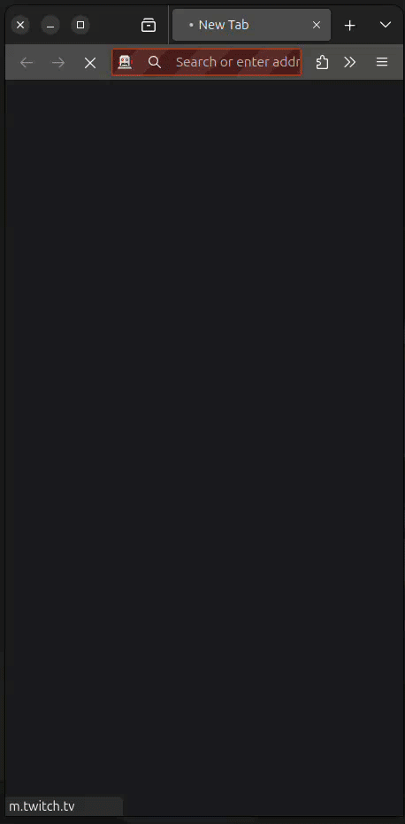

# WAP test

This project automates the browsing of the Twitch mobile site for the game Starcraft 2 using a Chrome browser on different devices, specifically a Pixel 7 and an iPhone SE.

## Configuration

The configuration for this project is stored in `config.yml`. Below is the current configuration:

```yaml
url: https://m.twitch.tv/
game: starcraft 2
browser: chrome
device: pixel7
devices: 
  - pixel7:
      height: 915
      width: 412
  - iphonese:
      height: 664
      width: 375
```

Configuration Details

- `url`: The URL to be accessed, in this case, the mobile version of Twitch.
- `game`: The specific game to browse, which is Starcraft 2.
- `browser`: The browser to be used, specified as Chrome.
- `device`: The default device to be used, specified as Pixel 7.
- `devices`: A list of devices with their screen dimensions.
    - `pixel7`: The height and width for a Pixel 7 device.
    - `iphonese`: The height and width for an iPhone SE device.

## Setup Instructions

Follow these steps to set up your development environment.

### Set PYTHONPATH

Set the PYTHONPATH to the current working directory:

```sh
export PYTHONPATH=$(pwd)
```

### Create a Virtual Environment

Create a virtual environment to manage dependencies:

```sh
python3 -m venv venv
```

### Activate the Virtual Environment

Activate the virtual environment:

- For macOS/Linux:

```sh
source venv/bin/activate
```

- For Windows:

```sh
.\venv\Scripts\activate
```

### Install Requirements

Install the necessary requirements from the requirements.txt file:

```sh
pip install -r requirements.txt
```

### Running the Script

To run the script, execute the following command:

```sh
pytest -s  tests/test_wap.py
```

## Executions demo

### Chrome


### Firefox


